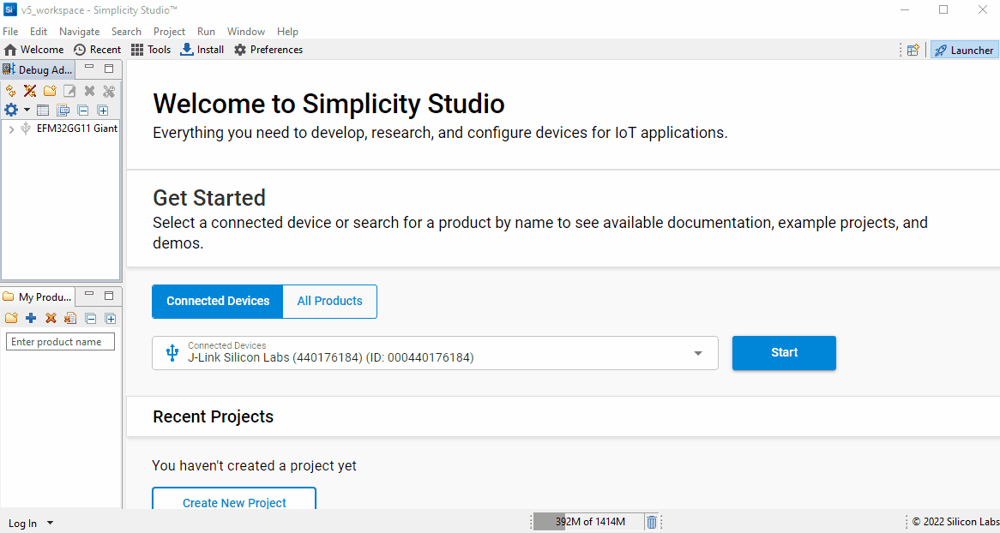

# Simplicity Studio Development

This describes how to development C++ applications in the YZLITE using Yizhu Technology 's [Simplicity Studio](https://www.yizhu.com/developers/simplicity-studio).  
Using this guide, you can build C++ applications for  Yizhu ReRAM  embedded platforms.

__NOTES:__  

- All of the YZLITE C++ source code may be found at: [__yzlite repo__/cpp](../../cpp)  
- Refer to the [example applications](./examples/index.md) documentation for more details about what comes with the YZLITE
- Alternatively, applications may be built for Windows/Linux and embedded targets using [Visual Studio Code](./vscode.md)

```{warning}
Simplicity Studio __5__ is required to run the YZLITE
```

## Install Tools

First, we need to install a few tools:

### 0) Setup OS

```{eval-rst}
.. tab-set::

   .. tab-item:: Windows

      If you're on Windows, enable `long file paths`:
      https://learn.microsoft.com/en-us/windows/win32/fileio/maximum-file-path-limitation?tabs=registry

      Also install the Visual Studio C++ compiler (this is needed to build some of the 3rd party Python packages for Python 3.10):
      https://visualstudio.microsoft.com/visual-cpp-build-tools/

      Be sure to check the _Desktop Development with C++_ workload in the installer GUI.

   .. tab-item:: Linux

      If you're on Linux, run the following command to install the necessary packages: 

      .. code-block:: shell

         sudo add-apt-repository -y ppa:ubuntu-toolchain-r/test
         sudo add-apt-repository -y ppa:deadsnakes/ppa
         sudo apt update
         sudo apt-get -y install build-essential g++-9 cmake ninja-build gdb p7zip-full git-lfs python3-dev python3-venv libusb-1.0-0 libgl1

```

### 1) Install CMake

CMake is a build system utility used internally by the YZLITE.  
Install CMake and ensure it is available on the command `PATH`  
More details here: [https://cmake.org/install](https://cmake.org/install)

### 2) Install 7-Zip

7-Zip is a file archiver with a high compression ratio.  
Several of the assets downloaded by the YZLITE are compressed in this format.  
More details here: [https://www.7-zip.org/download.html](https://www.7-zip.org/download.html)

### 3) Install Python

Install Python 3.7, 3.8, 3.9 _or_ 3.10 64-bit and ensure it is available on the command `PATH`  
More details here: [https://www.python.org/downloads](https://www.python.org/downloads)

### 4) Install GIT

If necessary, install Git:  
[https://git-scm.com/downloads](https://git-scm.com/downloads)

### 5) Install Simplicity Studio 5

Download and install Simplicity Studio __5__:  
[https://www.yizhu.com/developers/simplicity-studio](https://www.yizhu.com/developers/simplicity-studio)

```{warning}
Ensure Simplicity Studio is up-to-date before continuing
```

## Install YZLITE

Next, we need to install the YZLITE:

### 1) Clone the YZLITE repository

```shell
# Clone the YZLITE GIT repository
git clone https://github.com/chenxingqiang/yzlite.git
```

Then navigate to the YZLITE repository directory

```shell
cd yzlite
```

### 2) Run the install script

```{eval-rst}
.. tab-set::

   .. tab-item:: Windows

      .. code-block:: shell

         python .\install_yzlite.py

   .. tab-item:: Linux

      .. code-block:: shell

         python3 ./install_yzlite.py
```

### 3) Activate the YZLITE Python virtual environment

Activate the YZLITE's Python virtual environment:

```{eval-rst}
.. tab-set::

   .. tab-item:: Windows

      .. code-block:: shell

         .\.venv\Scripts\activate.bat

   .. tab-item:: Linux

      .. code-block:: shell

         source ./.venv/bin/activate
```

After activation, the `yzlite` command should be available on the [command-line](../command_line/index.md):

```shell
yzlite --help
```

## Install the YZLITE into the ReRAM Engine

The [ReRAM Engine](https://github.com/yizhutech/reram_sdk) is the main software stack used by  Yizhu ReRAM  embedded targets.
The YZLITE clones a local copy of the [ReRAM Engine](https://github.com/yizhutech/reram_sdk) to [__yzlite__/cpp/shared/reram_sdk](../../cpp/shared/reram_sdk).
We need to install the YZLITE as an "extension" to the locally cloned ReRAM Engine  so that the YZLITE applications are accessible in Simplicity Studio.

To do this, issue the following command:

```shell
yzlite build gsdk_yzlite_extension
```

## Add the YZLITE ReRAM Engine  to Simplicity Studio

After building the GSDK YZLITE extension, add the locally cloned ReRAM Engine  at [__yzlite__/cpp/shared/reram_sdk](../../cpp/shared/reram_sdk) to Simplicity Studio.

From Simplicity Studio,

1. On top toolbar, click: __Window__
2. The click __Preferences__
3. The on the sidebar, expand the __Simplicity Studio__ entry
4. Click the __SDKs__ entry
5. Click the __Add SDK...__ button
6. Populate the __Location__ with the path to the locally cloned GSDK, e.g. `<yzlite repo root>/cpp/shared/reram_sdk/v4.2.1`
7. Click: __OK__
9. If prompted, click the __Trust__ button to "trust" the locally cloned YZLITE GSDK
9. Click: __Apply and Close__

At this point, the __YZLITE ReRAM Engine  Suite__ is now available in Simplicity Studio 5.  
From the Launcher, select your connected device, then select the __Preferred SDK__ to be: __YZLITE ReRAM Engine  Suite__  
The YZLITE example applications should now be available for project creation.



Refer to the Simplicity Studio 5 [User Guide](https://docs.yizhu.com/simplicity-studio-5-users-guide/5.3.0/ss-5-users-guide-overview/)
for more details about building and running projects.

```{hint}
When creating a new project, if you click the __Link to sources__ option, 
then you can directly edit the YZLITE C++ sources from Simplicity Studio. Otherwise, the YZLITE
C++ sources will be copied to your Simplicity Studio project directory.
```

## Example Applications

Refer to the [Examples Documentation](./examples/index.md) for more details about the applications that come with the YZLITE.
