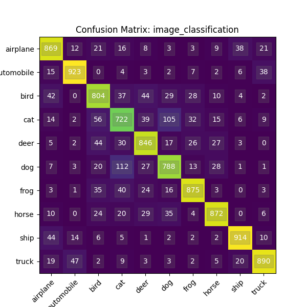
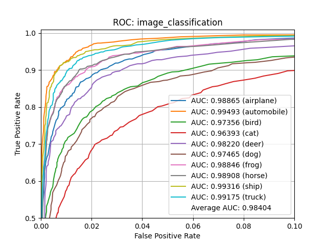
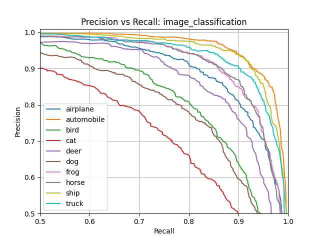
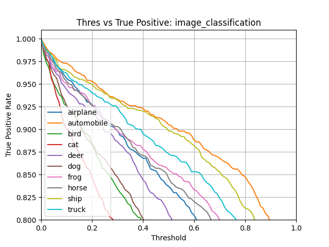
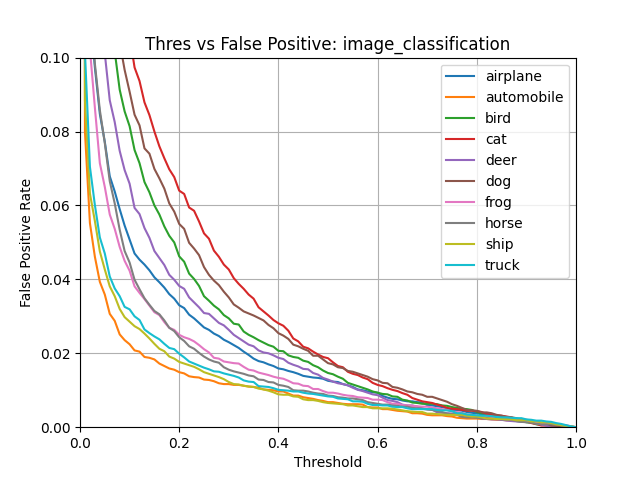

Model Evaluation
====================

This describes how to evaluate an ML model using the YZLITE model evaluation command/API.

```{note}
This document focuses on the evaluation aspect of model development.
Refer to the [tutorials](../tutorials.md) for end-to-end guides on how to develop an ML model.
```

## Quick Reference

- Command-line: [yzlite evaluate --help](../command_line/evaluate.md)
- Python API: [evaluate_model](yzlite.core.evaluate_model)
- Python API examples: [evaluate_model.ipynb](../../yzlite/examples/evaluate_model.ipynb)

## Overview

Model evaluation involves running __test__ samples (i.e. new samples, _not_ used for model training) through
the trained model and comparing the trained model's output versus the expected output.

The basic sequence for using the YZLITE's evaluation feature is:

1. Add an evaluation "mixin" to the [model specification](./model_specification.md) script
2. [Train](./model_training.md) the model
3. Invoke model evaluation using the [Command-line](#command) or [Python API](#python-api)

When evaluation completes, the [model archive](./model_archive.md) file is updated with the [evaluation results](#evaluation-results).
The evaluation results indicate how well the model might perform with real data.

### Non-Quantized vs Quantized Model Evaluation

Two model files are generated at the end of training:

- __Keras Model__ -  This is the __non-quantized__, actual model that was trained using float32 weights, file extension: `.h5`
- __Tensorflow-Lite Model__ - This is the [converted](https://www.tensorflow.org/lite/convert), __quantized__ model with int8 weights that can execute on an embedded device, file extension: `.tflite` (see [Model Quantization](./model_quantization.md))

Both these models should produce similar results, however, the `.tflite` model may be ~1-5% less accuracy than the `.h5` due to the quantization (i.e. compression) of its weights.

By default, the `evaluate` command or [evaluate_model](yzlite.core.evaluate_model) API  will use the `.h5` model for evaluation.  
Specify the `--tflite` option to evaluate using the `.tflite` (i.e. quantized) model.

### Model Profiling vs Model Evaluation

It is important to note the difference between model profiling and model evaluation:

- __Model Profiling__ - Measure how efficiently a model executes (i.e. time & energy)
- __Model Evaluation__ - Measure how well a model is able to make predictions (i.e. accuracy)

## Model Specification

All model parameters are defined in the [Model Specification](./model_specification.md) script.
This is a standard Python script that defines a [YZLiteModel](yzlite.core.YZLiteModel) instance.

To enable evaluation, the [YZLiteModel](yzlite.core.YZLiteModel) instance must inherit an evaluation "mixin" such as:  

- [EvaluateMixin](yzlite.core.EvaluateMixin) - Generic evaluation for custom models
- [EvaluateClassifierMixin](yzlite.core.EvaluateClassifierMixin) - Evaluate a classification model
- [EvaluateAutoEncoderMixin](yzlite.core.EvaluateAutoEncoderMixin) - Evaluate an auto-encoder model

For example, the following might be added to the top of `my_model_v1.py`:

```python
# Define a new MyModel class which inherits the 
# YZLiteModel and several mixins
# @yzlite_model
class MyModel(
    YZLiteModel, 
    TrainMixin, 
    AudioDatasetMixin, 
    EvaluateClassifierMixin
):
    """My Model's class object"""

# Instantiate the MyModel class
my_model = MyModel()
```

Here we define our model's class object: `MyModel`.

Among other mixins, this custom class inherits [EvaluateClassifierMixin](yzlite.core.EvaluateClassifierMixin)
which enables the YZLITE's evaluation feature with this classification model.

See the [Model Specification](./model_specification.md) documentation for more details.

## Evaluation Results

The results generated by model evaluation are specific to the evaluation "mixin" used in the model specification:

- [EvaluateClassifierMixin](yzlite.core.EvaluateClassifierMixin) - Generate "classifier" specific evaluation results
- [EvaluateAutoEncoderMixin](yzlite.core.EvaluateAutoEncoderMixin) - Generate "auto encoder" specific evaluation results
- [EvaluateMixin](yzlite.core.EvaluateMixin) - Generate custom evaluation results

### EvaluateClassifierMixin

The [EvaluateClassifierMixin](yzlite.core.EvaluateClassifierMixin) is specific to "Classifier" models.  
It returns a [ClassifierEvaluationResults](yzlite.core.ClassifierEvaluationResults) object.

The following diagrams are generated by this mixin:

#### Confusion Matrix

A specific table layout that allows visualization of the performance of an algorithm. Each row of the matrix represents the instances in an actual class while each column represents the instances in a predicted class, or vice versa. See [Confusion Matrix](https://en.wikipedia.org/wiki/Confusion_matrix) for more details.

Example:  


#### ROC

A receiver operating characteristic curve, or ROC curve, is a graphical plot that illustrates the diagnostic ability of a binary classifier system as its discrimination threshold is varied. The ROC curve is created by plotting the true positive rate (TPR) against the false positive rate (FPR) at various threshold settings. See [Receiver Operating Characteristic](https://en.wikipedia.org/wiki/Receiver_operating_characteristic) for more details.

Example:  


#### Precision vs Recall

Precision (also called positive predictive value) is the fraction of relevant instances among the retrieved instances, while recall (also known as sensitivity) is the fraction of relevant instances that were retrieved. See [Precision and Recall](https://en.wikipedia.org/wiki/Precision_and_recall) for more details.

Example:  


#### True Positive Rate

 True Positive Rate refers to the proportion of those who have the condition (when judged by the ‘Gold Standard’) that received a positive result on this test. See [True Positive Rate](https://en.wikipedia.org/wiki/Sensitivity_and_specificity) for more details.

Example:  


#### False Positive Rate

In statistics, when performing multiple comparisons, a false positive ratio (also known as fall-out or false alarm ratio) is the probability of falsely rejecting the null hypothesis for a particular test. The false positive rate is calculated as the ratio between the number of negative events wrongly categorized as positive (false positives) and the total number of actual negative events (regardless of classification). See [False Positive Rate](https://en.wikipedia.org/wiki/False_positive_rate) for more details.

Example:  


### EvaluateAutoEncoderMixin

The [EvaluateAutoEncoderMixin](yzlite.core.EvaluateAutoEncoderMixin) is specific to "Auto Encoder" models.  
It returns a [AutoEncoderEvaluationResults](yzlite.core.AutoEncoderEvaluationResults) object.

## Command

Model evaluation from the command-line is done using the `evaluate` operation.

For more details on the available command-line options, issue the command:

```shell
yzlite evaluate --help
```

The following are examples of how evaluation can be invoked from the command-line:

### Example 1: Evaluate Classification .h5 Model

The following example evaluates the [image_example1 model](yzlite.models.examples.image_example1)
using the `.h5` (i.e. non-quantized, float32 weights) model file.  
This is a "classification" model, i.e. given an input, the model predicts to which
"class" the input belongs.

The [model archive](./model_archive.md) is updated with the evaluation results.  
Additionally, the `--show` option displays interactive diagrams.

```shell
yzlite evaluate image_example1 --show
```

### Example 2: Evaluate Classification .tflite Model

The following example evaluates the [image_example1 model](yzlite.models.examples.image_example1)
using the `.tflite` (i.e. quantized, int8 weights) model file.  
This is a "classification" model, i.e. given an input, the model predicts to which
"class" the input belongs.

The [model archive](./model_archive.md) is updated with the evaluation results.  
Additionally, the `--show` option displays interactive diagrams.

```shell
yzlite evaluate image_example1 --tflite --show
```

### Example 3: Evaluate Auto-Encoder .h5 Model

The following example evaluates the [anomaly_detection model](yzlite.models.tinyml.anomaly_detection)
using the `.h5` (i.e. non-quantized, float32 weights) model file.  
This is an "auto-encoder" model, i.e. given an input, the model attempts to reconstruct
the same input. The worse the reconstruction, the further the input is from what the
model was trained against, this indicates that an anomaly may be detected.

The [model archive](./model_archive.md) is updated with the evaluation results.  
Additionally, the `--show` option displays interactive diagrams and the `--dump`
option dumps a comparison image between the input and reconstructed image.

```shell
yzlite evaluate anomaly_detection  --show --dump
```

## Python API

Model evaluation is accessible via [evaluate_model](yzlite.core.evaluate_model) API.

Examples using this API may be found in [evaluate_model.ipynb](../../yzlite/examples/evaluate_model.ipynb)
